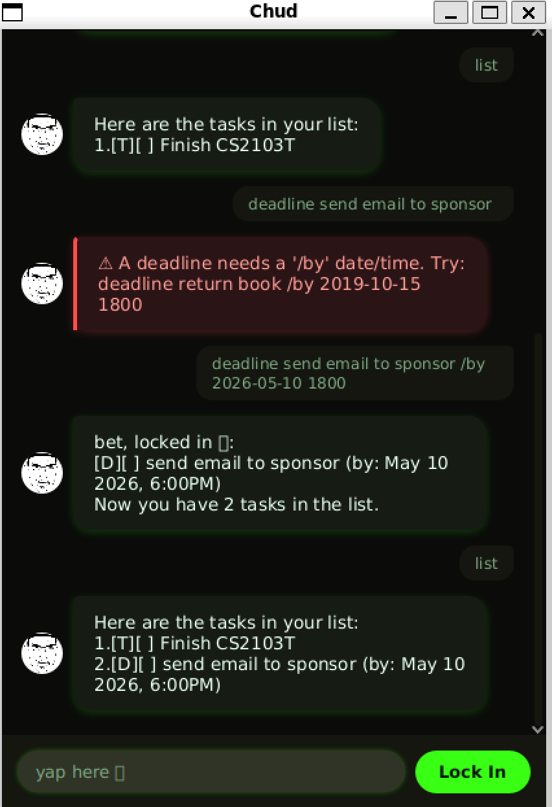

# Chud User Guide

**Chud** is a desktop chatbot that tracks your todos, deadlines, and events -- typed as one-line
commands into a chat window, in a voice that's a little too locked in.



## Quick start

1. Make sure you have **Java 25** installed.
2. Get `chud.jar` -- either grab it from the [Releases page](https://github.com/Alpharion/ip/releases),
   or build it yourself from source: `./gradlew shadowJar` produces it at `build/libs/chud.jar`.
3. Copy `chud.jar` into any folder you're happy for Chud to save its data in.
4. Open a terminal in that folder and run:
   ```
   java -jar chud.jar
   ```
5. Type a command into the box at the bottom and press Enter (or click **Lock In**).

That's it -- your tasks are saved automatically after every change, to `data/chud.txt` next to
the jar, and reloaded the next time Chud starts. Nothing is lost between sessions, and a missing
or damaged save file is never a crash: a missing one just means an empty list to start; a
corrupted line is skipped (with a quiet warning) instead of taking down the rest of your tasks.

Task numbers used by `mark`/`unmark`/`delete` are the position shown by `list` -- 1 for the first
task, 2 for the second, and so on.

## Adding a todo: `todo`

Adds a task with just a description -- no date or time attached.

Format: `todo DESCRIPTION`

Example: `todo borrow book`

```
bet, locked in 🔒:
  [T][ ] borrow book
Now you have 1 tasks in the list.
```

## Adding a deadline: `deadline`

Adds a task with a description and a `/by` date/time. Chud understands several formats and
always shows the date back the same friendly way, regardless of which one you typed.

Accepted date/time formats (for `/by`, `/from`, `/to`, and `on`, below):

- `yyyy-mm-dd`, e.g. `2019-10-15`
- `yyyy-mm-dd HHmm` (24-hour time), e.g. `2019-10-15 1800`
- `d/m/yyyy`, e.g. `2/12/2019`
- `d/m/yyyy HHmm`, e.g. `2/12/2019 1800`

Format: `deadline DESCRIPTION /by WHEN`

Example: `deadline return book /by 2/12/2019 1800`

```
bet, locked in 🔒:
  [D][ ] return book (by: Dec 02 2019, 6:00PM)
Now you have 2 tasks in the list.
```

## Adding an event: `event`

Adds a task with a description and both a `/from` and a `/to` date/time, in that order. Both
accept the same formats as a deadline's `/by`.

Format: `event DESCRIPTION /from WHEN /to WHEN`

Example: `event project meeting /from 2/12/2019 1400 /to 2/12/2019 1600`

```
bet, locked in 🔒:
  [E][ ] project meeting (from: Dec 02 2019, 2:00PM to: Dec 02 2019, 4:00PM)
Now you have 3 tasks in the list.
```

## Listing all tasks: `list`

Shows every task currently in your list, numbered.

Format: `list`

Example: `list`

```
Here are the tasks in your list:
1.[T][ ] borrow book
2.[D][ ] return book (by: Dec 02 2019, 6:00PM)
3.[E][ ] project meeting (from: Dec 02 2019, 2:00PM to: Dec 02 2019, 4:00PM)
```

### Sorting the list: `list /sort`

Add `/sort KEY` to `list` to reorder your tasks -- **permanently**, so the new order is what
`mark`/`unmark`/`delete` numbers (and every later plain `list`) use from then on.

Format: `list /sort KEY [asc|desc]` (`asc` is the default if you leave it out)

| `KEY` | Ascending order |
|---|---|
| `date` | Soonest first (a deadline's due date, or an event's start date). A todo has no date and always sorts last, in both directions. |
| `description` | Alphabetically, A-Z, case-insensitive. |
| `type` | Todo, then Deadline, then Event. |
| `done` | Not-done tasks before done tasks. |

Example: `list /sort date desc`

```
Here are the tasks in your list:
1.[D][ ] return book (by: Dec 02 2019, 6:00PM)
2.[E][ ] project meeting (from: Dec 02 2019, 2:00PM to: Dec 02 2019, 4:00PM)
3.[T][ ] borrow book
```

## Listing tasks on a date: `on`

Shows only the deadlines and events occurring on a given date -- a deadline matches if its `/by`
date matches, and an event matches if the date falls within its `/from`-`/to` range. Todos never
appear here (they have no date).

Format: `on WHEN`

Example: `on 2019-12-02`

```
Here are the tasks occurring on Dec 02 2019:
1.[E][ ] project meeting (from: Dec 02 2019, 2:00PM to: Dec 02 2019, 4:00PM)
```

## Finding tasks by keyword: `find`

Shows only the tasks whose description contains the given keyword (case-insensitive; dates and
task type aren't searched).

Format: `find KEYWORD`

Example: `find book`

```
Here are the matching tasks in your list:
1.[T][X] read book
2.[D][X] return book (by: Jun 06 2019)
```

## Marking a task as done: `mark`

Format: `mark INDEX`

Example: `mark 1`

```
W rizz, secured the bag 🏆:
  [T][X] borrow book
```

## Marking a task as not done: `unmark`

Format: `unmark INDEX`

Example: `unmark 1`

```
mid, back to the grind 💀:
  [T][ ] borrow book
```

## Deleting a task: `delete`

Format: `delete INDEX`

Example: `delete 2`

```
yeeted into the shadow realm 🫡:
  [D][ ] return book (by: Dec 02 2019, 6:00PM)
Now you have 2 tasks in the list.
```

## Exiting: `bye`

Format: `bye`

```
aight bye fr, stay locked in 🗿✌️
```

## When something's wrong

A typo, a missing date, an out-of-range task number -- none of it crashes Chud. You'll get a
specific, correctable message instead, shown in a red bubble so it's easy to spot at a glance:

```
bruh 💀 A deadline needs a '/by' date/time. Try: deadline return book /by 2019-10-15 1800
```

This happens for things like:

- An unrecognized command word.
- A `todo`, `deadline`, or `event` with a missing or empty description.
- A `deadline` missing its `/by`, or an `event` missing its `/from`/`/to` (or given out of order).
- A `/by`, `/from`, `/to`, or `on` date/time that isn't in one of the accepted formats.
- A `mark`, `unmark`, or `delete` with a missing, non-numeric, or out-of-range task number.
- A `find` with an empty keyword, or a `list /sort` with an unrecognized key or direction.

## Command summary

| Action | Format | Example |
|---|---|---|
| Add a todo | `todo DESCRIPTION` | `todo borrow book` |
| Add a deadline | `deadline DESCRIPTION /by WHEN` | `deadline return book /by 2/12/2019 1800` |
| Add an event | `event DESCRIPTION /from WHEN /to WHEN` | `event project meeting /from 2/12/2019 1400 /to 2/12/2019 1600` |
| List all tasks | `list` | `list` |
| Sort the list | `list /sort KEY [asc\|desc]` | `list /sort date desc` |
| List tasks on a date | `on WHEN` | `on 2019-12-02` |
| Find tasks by keyword | `find KEYWORD` | `find book` |
| Mark a task done | `mark INDEX` | `mark 1` |
| Mark a task not done | `unmark INDEX` | `unmark 1` |
| Delete a task | `delete INDEX` | `delete 2` |
| Exit | `bye` | `bye` |
